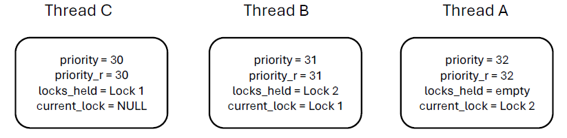
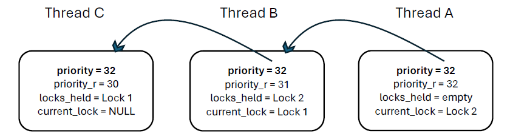

# Project 1 - Threads

## Alarm Clock

### Data Structures

**A1**: Copy here the declaration of each new or changed `struct` or `struct` member, global or static variable, `typedef`, or enumeration. Identify the purpose of each in 25 words or less.

```c
// thread.h
// Added wakeup_after of type int64_t, to store the ticks the thread should sleep.
int64_t wakeup_after;
// Initialized in struct thread another variable struct list_elem sleepelem to store the list of sleeping threads.
struct list_elem sleepelem;
// Function declaration to set the thread's sleeping time.
void set_thread_sleeping_time(int64_t ticks);
```

### Algorithms

**A2**: Briefly describe what happens in a call to `timer_sleep()`, including the effects of the timer interrupt handler.

When `timer_sleep()` is called, the current thread is set to sleep without busy waiting, allowing other threads to run during this time. The steps are:

-   Check if the `ticks` value is non-positive. If it is 0 or negative, the function returns immediately since there's no need to put the thread to sleep.
-   Disable interrupts to prevent race conditions while modifying the current thread's state. The current thread's `wakeup_after` is set to the value of `ticks`, indicating how long it should sleep.
-   The thread is blocked using `thread_block()`, meaning it won't be scheduled until it's unblocked.
-   After blocking the thread, interrupts are re-enabled to allow other parts of the system to continue.
-   If a thread's `wakeup_after` reaches 0, the sleep duration has elapsed, and the thread is unblocked using `thread_unblock()`. Unblocked threads are then put back into the ready list, making them available to be scheduled by `schedule()`.

**A3**: What steps are taken to minimize the amount of time spent in the timer interrupt handler?

-   The `timer_interrupt()` handler directly decrements the time remaining for each sleeping thread by one for each tick.
-   The check for whether a thread needs to be woken up is a simple comparison. If `wakeup_after` is less than or equal to zero, the thread is ready to be unblocked.
-   By using `thread_foreach()`, we iterate over all threads in a single pass, minimizing the overhead.
-   Only when `wakeup_after` reaches zero is `thread_unblock()` called, avoiding unnecessary scheduling operations.

### Synchronization

**A4**: How are race conditions avoided when multiple threads call `timer_sleep()` simultaneously?

-   Before a thread modifies shared data, interrupts are disabled by calling `intr_disable()`, ensuring atomic modifications.
-   The thread calls `thread_block()`, which removes it from the ready list and places it in a blocked state.
-   After the thread has been blocked, interrupts are re-enabled with `intr_set_level(INTR_ON)`.
-   Access to the `sleeping_threads` list is controlled by the interrupt handler, which runs atomically, making access thread-safe.

**A5**: How are race conditions avoided when a timer interrupt occurs during a call to `timer_sleep()`?

-   The code disables interrupts before executing any code that could be interrupted by a timer interrupt using `intr_disable()`.
-   With interrupts disabled, the thread safely updates its `wakeup_after` and then calls `thread_block()` to change its status to blocked.
-   After the thread has been blocked and operations are completed, the previous interrupt level is restored with `intr_set_level(old_level)`.

### Rationale

**A6**: Why did you choose this design? In what ways is it superior to another design you considered?

We chose a separate list to manage sleeping threads instead of using the `all_list` because:

-   Using a separate `sleeping_threads` list reduces the overhead of traversing the `all_list`, which can contain many threads not sleeping.
-   As the system scales and the number of threads increases, the performance impact of traversing a large `all_list` could become significant. The separate list for sleeping threads is a scalability optimization.

## Priority Scheduling

### Data Structures

**B1**: Copy here the declaration of each new or changed `struct` or `struct` member, global or static variable, `typedef`, or enumeration. Identify the purpose of each in 25 words or less.

```c
// synch.h
struct lock {
    struct list_elem elem; // List element for locks
    int max_priority; // Maximum priority of threads waiting on this lock
};

// thread.h
int priority_r; // Original priority without donations
struct list locks_held; // List of locks held by the thread
struct lock *current_lock; // Lock that the thread is currently waiting on

// synch.c
struct semaphore_elem {
    int priority; // Priority level within a semaphore's waiters for ordering
};
```

synch.h:

-   `struct list_elem elem;`
-   ``int max_priority;`
-   `struct lock` which represents a lock in the system. We added `maximum_priority`, of type int indicating the highest priority of all threads waiting for this lock. This helps in implementing priority donation, as the lock can keep track of the highest priority among the threads that are waiting on it and potentially donate this priority to its holder to avoid priority inversion.

thread.h:

-   `int priority_r;`
-   `struct list locks_held;`
-   `struct lock *current_lock;`
-   `struct thread` which represents a thread in the system. The `priority` field is the current active priority of the thread, which may be donated if it's waiting on a lock held by a lower-priority thread. The `priority_r` is the original priority of the thread without any donations. `locks_held` is a list of locks that the thread is currently holding, which is used to revert the priority when locks are released. current_lock will point to the lock that the thread is currently.

synch.c:

-   `int priority;`
-   `struct semaphore_elem` Priority level within a semaphore's waiters for ordering. When a semaphore has multiple threads waiting to acquire it, in the semaphore's waiters list, the system needs a way to ensure that the highest-priority thread is selected next when the semaphore is released.

**B2**: Explain the data structure used to track priority donation. Use ASCII art to diagram a nested donation. (Alternately, submit a .png file.)
Let us consider three threads involved in a nested donation scenario:

-   Thread A (highest priority), Thread B (medium priority), and Thread C (lowest priority).
-   Scenario 1: Thread C holds Lock 1, which Thread B is waiting for, and Thread B holds another Lock 2 that Thread A is waiting for. The goal of priority donation is to temporarily raise the priority of Thread C so that it can finish its work and release Lock 1, and Thread B as it is also needed by the higher-priority Thread A.



After donation:



-   Now Thread C execute and release Lock 1 and returns to priority = 30, then Thread B is in ready list and after executing releases Lock 2, which then reduces priority to 31. Finally, Thread A acquires Lock 2, finish execution.

### Algorithms

**B3**: How do you ensure that the highest priority thread waiting for a lock, semaphore, or condition variable wakes up first?

Our implementation ensures that the highest priority thread wakes up first by using ordered lists. Whenever a thread is added to a waiting list like `sema->waiters`, it is inserted in priority order. For semaphores, `get_maximum_priority_sema()` fetches the highest priority waiting thread to be unblocked first. Similarly, for locks and condition variables, the waiters are managed in a priority queue where the highest priority thread is always at the front of the queue.

**B4**: Describe the sequence of events when a call to `lock_acquire()` causes a priority donation. How is nested donation handled?

When `lock_acquire()` is called:

-   Check if the lock is already held by another thread. If so, and the current thread has higher priority, donate priority:
    -   Disable interrupts for atomicity.
    -   Assign the lock being acquired to `thread_current()->current_lock`.
    -   Recursively update the `maximum_priority` of the lock and the priority of the lock holder.
    -   If the lock holder is waiting on another lock, repeat the donation process.
    -   Restore interrupts after updating priorities.
-   Use `sema_down()` to wait for the lock if it is not immediately available.
-   After acquiring the lock, add it to the current thread’s `locks_held`.
-   Update the priority of the current thread based on the highest priority lock it now holds.
-   Check if the current thread should yield the CPU due to another thread's higher priority and do so if needed.

Nested donations are handled through the recursive updating of lock priorities and the thread holders' priorities that hold these locks.

**B5**: Describe the sequence of events when `lock_release()` is called on a lock that a higher-priority thread is waiting for.

Upon `lock_release()`:

-   Disable interrupts to prevent race conditions.
-   Remove the lock from the current thread's `locks_held` list.
-   If the current thread has no more locks affecting its priority, restore its original priority.
-   Call `sema_up()` to wake up the next thread waiting on the lock, ensuring it's the highest priority thread due to the ordered wait list.
-   Enable interrupts.
-   Update the priority of the current thread, considering any remaining locks held.
-   Check if yielding is necessary due to other threads having a higher priority and yield the CPU if so.

### Synchronization

**B6**: Describe a potential race in `thread_set_priority()` and explain how your implementation avoids it. Can you use a lock to avoid this race?

A possible race condition happens in `thread_set_priority()` when multiple threads attempt to change their priorities simultaneously, leading to inconsistencies in the ready list. This race could affect the order in which threads are selected for execution, leading to priority inversion or starvation.

In our implementation, we avoid this race by:

-   Disabling interrupts with `intr_disable()` at the beginning of `thread_set_priority()`, ensuring that the entire operation of changing a thread's priority and yielding the CPU is atomic.
-   After updating the thread's priority, we then check the ready list to see if the current thread should continue executing or yield the CPU to a higher-priority thread. This decision is made atomically within the same critical section.
-   Interrupts are re-enabled as `intr_set_level(old_level)` after the priority change and yield operation are completed.

Using a lock to avoid this race would not be ideal because locks themselves depend on priority to prevent inversion issues. Disabling interrupts is a more straightforward approach to ensure atomicity without introducing deadlock risks that locks might have.

### Rationale

**B7**: Why did you choose this design? In what ways is it superior to another design you considered?

We chose this design to ensure that thread priorities are managed consistently and atomically.

-   Disabling interrupts ensures that the entire priority change operation, including the check to yield the CPU, is performed without any interruption.
-   There is a possibility of dead

locks while using locks, so disabling interrupts is a simple way to ensure mutual exclusion without adding overhead or risk.

This design focuses on synchronization, ensuring that the system's critical sections are protected against concurrent access, which is a crucial requirement.

## Advanced Scheduler

### Data Structures

**C1**: Copy here the declaration of each new or changed `struct` or `struct` member, global or static variable, `typedef`, or enumeration. Identify the purpose of each in 25 words or less.

```c
// thread.h
int nice; // Determines how "nice" the thread should be to other threads, affecting its priority indirectly.
fixed_point_t r_cpu; // Measures the amount of CPU time a thread has received recently, used in calculating its priority.
static fixed_point_t mlfqs_average_load; // Estimates the average number of threads ready to run over the past minute, used in calculating thread priorities under MLFQS scheduler.
```

### Algorithms

**C2**: Suppose threads A, B, and C have nice values 0, 1, and 2. Each has a recent_cpu value of 0. Fill in the table below showing the scheduling decision and the priority and recent_cpu values for each thread after each given number of timer ticks:

```
t->r_cpu = fix_add(t->r_cpu,fix_int(1));
int priority_n = (int) fix_round(
fix_sub(
fix_int(PRI_MAX - ((t->nice) * 2)),
fix_unscale(t->r_cpu, 4)));
```

PRI_MAX is 63.
Initial priorities based on their nice values:

-   For A: priority = 63 - (0/4) - (0x2) = 63.
-   For B: priority = 63 - (0/4) - (1x2) = 61.
-   For C: priority = 63 - (0/4) - (2x2) = 59.

| Timer Ticks | Recent CPU A | Recent CPU B | Recent CPU C | Priority A | Priority B | Priority C | Thread to Run |
| ----------- | ------------ | ------------ | ------------ | ---------- | ---------- | ---------- | ------------- |
| 0           | 0            | 0            | 0            | 63         | 61         | 59         | A             |
| 4           | 4            | 0            | 0            | 62         | 61         | 59         | A             |
| 8           | 8            | 0            | 0            | 61         | 61         | 59         | A/B           |
| 12          | 12           | 0            | 0            | 60         | 61         | 59         | B             |
| 16          | 12           | 4            | 0            | 60         | 60         | 59         | A/B           |
| 20          | 16           | 4            | 0            | 59         | 60         | 59         | B             |
| 24          | 16           | 8            | 0            | 59         | 59         | 59         | A             |
| 28          | 20           | 8            | 0            | 58         | 59         | 59         | B             |
| 32          | 20           | 12           | 0            | 58         | 58         | 59         | C             |
| 36          | 20           | 12           | 4            | 58         | 58         | 58         | A             |

**C3**: Did any ambiguities in the scheduler specification make values in the table uncertain? If so, what rule did you use to resolve them? Does this match the behavior of your scheduler?

Yes. We handled the implementation where operations are atomic. We are controlling thread yielding within an interrupt context, which prevents ambiguity in thread priority calculations.

**C4**: How is the way you divided the cost of scheduling between code inside and outside interrupt context likely to affect performance?

-   Outside of interrupt contexts, more computationally intensive operations, such as recalculating the `recent_cpu` value for all threads or reevaluating lock priorities, are performed.
-   By handling immediate scheduling decisions, like thread priority recalculations and load average updates, within interrupt contexts, the implementation ensures that critical updates occur timely, reducing latency for priority adjustments.

### Rationale

**C5**: Briefly critique your design, pointing out advantages and disadvantages in your design choices. If you were to have extra time to work on this part of the project, how might you choose to refine or improve your design?

We have kept the design simple and reduced all computational usage. We kept it to the point and only included the required calculations. As we pass through the tests, we are also using the scheduling in such a way that it handles the load changes.

**C6**: The assignment explains arithmetic for fixed-point math in detail, but it leaves it open to you to implement it. Why did you decide to implement it the way you did? If you created an abstraction layer for fixed-point math, that is, an abstract data type and/or a set of functions or macros to manipulate fixed-point numbers, why did you do so? If not, why not?

We are provided with `fixedpoint.h` which are used as:

-   `fix_int` to convert integers to fixed-point format, `fix_add` for addition, `fix_mul` for multiplication. `fix_scale` and `fix_unscale` to perform multiplication and division with integer and fixed point number.

---
